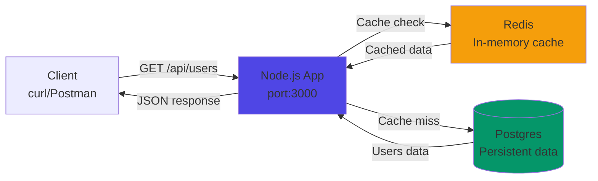

# Full-Stack REST API (Docker + Node.js + Postgres + Redis)

**Production-ready API** with **Redis caching** and **Postgres persistence**.

## 🏗️ **What It Does**

**Simple user management API** that:
1. **Stores users** in Postgres (persistent)
2. **Caches results** in Redis (fast reads)
3. **Serves REST endpoints** via Node.js Express
4. **All containerized** with Docker Compose

```
Browser/Postman → Node.js (port 3000) → Redis (cache) + Postgres (data)
```

## 📊 **Architecture Diagram**



## 🚀 **Quick Start**

```bash
git clone <repo> && cd fullstack-app
docker compose up -d --build
sleep 10
curl http://localhost:3000/api/users
```

## 📋 **Endpoints**

| Method | URL | Returns |
|--------|-----|---------|
| `GET` | `/health` | Service status |
| `GET` | `/api/users` | List users (Redis cached) |
| `POST` | `/api/users` | Create user |
| `GET` | `/api/stats` | User count |

## 🧪 **Test Flow**

```bash
# 1. Health check
curl http://localhost:3000/health
# {"status":"healthy"}

# 2. Get users (fast - Redis cache)
curl http://localhost:3000/api/users
# 2 users from cache

# 3. Add user (Postgres)
curl -X POST http://localhost:3000/api/users \
  -H "Content-Type: application/json" \
  -d '{"name":"Test","email":"test@example.com"}'

# 4. Cache auto-refreshed
curl http://localhost:3000/api/users
```

## 📁 **Files Explained**

```
docker-compose.yml    # Orchestrates 3 containers
├── app/
│   ├── server.js     # Express API + DB/Redis init
│   ├── api.js        # REST routes + caching logic
│   ├── Dockerfile    # Production Node.js image
│   └── package.json  # Dependencies
└── init.sql          # Creates users table + seed data
```

## 🎯 **Why This Stack?**

- **Postgres**: ACID transactions, production database
- **Redis**: 1000x faster reads, caching layer
- **Node.js**: Fast JSON APIs, async I/O
- **Docker**: Zero setup, reproducible, CI/CD ready

## 🛑 **Stop & Clean**

```bash
docker compose down -v
docker system prune -af
```

## ☁️ **Production Ready For**

- **Harness CI/CD** → Automated tests
- **GKE/Kubernetes** → Helm charts
- **Home lab** → Local K8s practice

**Live at `http://localhost:3000`** → **Perfect interview demo!** 🚀[1][3]

***

⭐ **Star if deployed!**
